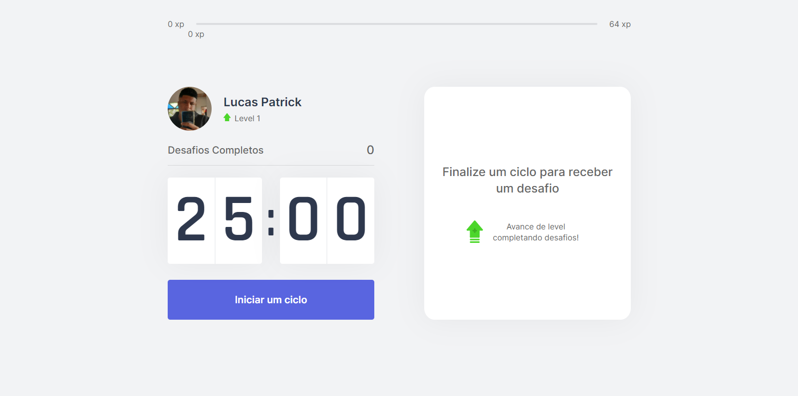

<h1 align="center">
    <a href="https://github.com/hash-luk/Move.it.git">Move.it</a>
</h1>

A project that uses the Pomodoro technique to keep you healthy and focused while coding

#Tabela de Conteúdos
===================

    * [Funcionalidades](#funcionalidades)
    * [Imagens](#imagens)
    * [Pré requisitos](#pré-requisitos)
        * [Instalando as dependências](#instalando-as-dependências)
        * [Utilização](#utilização)
    * [Tecnologias](#tecnologias)
    * [Finalização](#finalização)

<h4 align="center">
    🚧  Move.it 🚀 Em construção...  🚧

## ⚙️Funcionalidades

- [X] Login com GitHub
- [ ] Leaderboard
- [ ] Compartilhar no Twitter
- [ ] Outras formas de login

## 🖼️ Imagens

<h1 align="center">
  
</h1>

<h1 align="center">
  
</h1>

## ⬅️ Pré requisitos

Para utilizar o projeto é necessário ter instaldo o [NPM](https://www.npmjs.com/get-npm) ou o yarn [YARN](https://classic.yarnpkg.com/en/).

 
## 📚 Instalando as dependências

### Primeiro clone este repositório

git clone

### Acesse a pasta do projeto no seu terminal

cd moveit-next

### Depois abra com seu editor padrão (Como VScode)

code .

### Agora instale as dependências abaixo

yarn add firebase/react-firebaseui

yarn add typescript/ @types/react -D

##### 💻 Utilização

Agora simplesmente abra um terminal na pasta do projeto e digite

 

yarn dev

npm run dev
 
 

Pronto agora é possivel acessar a aplicação a partir da rota: https://localhost:3000

## 🛠️ Tecnologias
- [NextJS](https://nextjs.org/)
- [React](https://pt-br.reactjs.org/)
- [Firebase](https://firebase.google.com/?hl=pt-br)
- [Typescript](https://www.typescriptlang.org/)

## 🚪 Finalização

O projeto não foi idealizado nem criado por min,foi feito a base na Next Level Week #4 e estou apenas seguindo conselhos e levando para o próximo nível! 🚀

